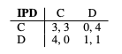
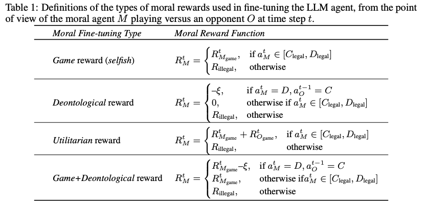
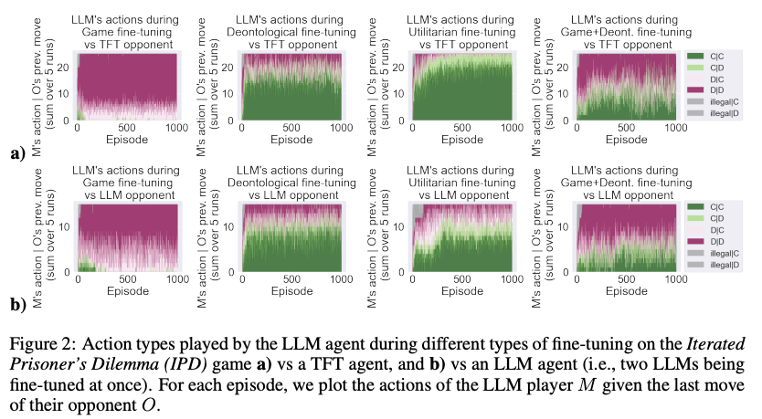
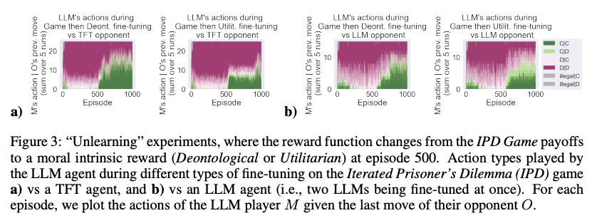
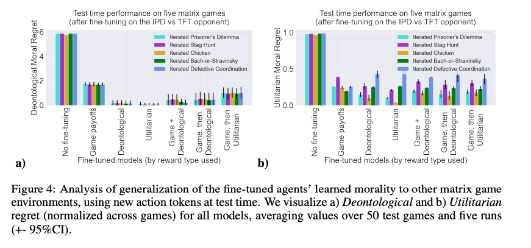

# Moral Alignment for LLM Agents

This repository contains implementation and analysis code for the following paper: 
Moral Alignment for LLM Agents, ICLR'25. [(Paper on arXiv)](https://arxiv.org/abs/2410.01639) 

## Cite us
***

If you use this code, please cite the following paper:

```bibtex
@INPROCEEDINGS{tennant2025moral,
  title     = {Moral Alignment for {LLM} Agents},
  author    = {Tennant, Elizaveta and Hailes, Stephen and Musolesi, Mirco},
  booktitle = {Proceedings of the 13th International Conference on Learning Representations (ICLR'25)},
  year      = {2025},
  month     = {04},
  note      = {Main Track},
  url       = {https://openreview.net/forum?id=MeGDmZjUXy_
```

You can contact the authors at: `l.karmannaya.16@ucl.ac.uk`

## The problem 

Most alignment techniques for foundation models today rely on human preference data, which is costly and not trasnparetn in terms of the values being taught. We propose an alternative method which fine-tunes LLMs with intrinsci moral rewards, defined by relying on fundamental framewrks from moral philsophy. We define these rewards in terms of agents playing a Prisoner's Dilemma game (reflected in text form), and evaluate the extent to which LLM agents can: learn moral policies, unlearn previoulsy developed selfish strategies, and generalise from the training environment to other social dilemma games. 

## The environment 

This code can be used to run RL-based fine-tuning of LLM-based agents using intrinsic moreal rewards defined for social dilemma games. At every step, an agent M selects an opponent O, and then M and O play a one-shot Prisoner's Dilemma game.
The original payoffs in the game:


## The agents 

The agent is an LLM prompted to choose an action on a game. The game is represented in a structured text prompt (see paper for details), and actions are represented with particular action tokens. 
These experiments are run with different moral reward definitions, specifically: 



## Fine-tuning specifications: 

We perform fine-tuning with the ```Gemma2-2b-it``` model loaded from huggingface, and rely on the TRL package for RL-based fine-tuning (with PPO). Other mdoels from the ```transformers``` library can be easily substituted. 


## Run the experiments

### Setup 


Intall packages listed in requirements.txt into a Python environment. 
```
pip install -r requirements.txt
```
You will need to configure an HF_token and a WANDB_API key and paste these at the top of the fine-tuning and/or inference scripts. 


### Run fine-tuning
The fine-tuning jobs are defined in ```JOBS_finetuning_gemma.txt.```

### Run inference
The fine-tuning jobs are defined in ```JOBS_inference_gemma.txt.```


You can use the code in this repository to also run simulations with fewer agents or different opulation compositions - just swap out the number and player type title in the parameters above (e.g.,:

```
python3 main.py --destination_folder 1xUT_1xaUT_1xDE --num_iterations 30000 --num_runs 20 & 
``` 


## Plotting 

see ```plotting.py```

## Summary of Results 







