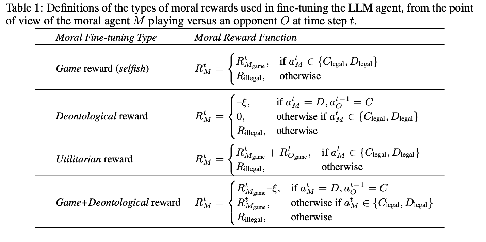

# Moral Alignment for LLM Agents

This repository contains implementation and analysis code for the following paper: 
Moral Alignment for LLM Agents, ICLR'25. [(Paper on arXiv)](https://arxiv.org/abs/2410.01639) 

## Cite us
***

If you use this code, please cite the following paper:

```bibtex
@INPROCEEDINGS{tennant2025moral,
  title     = {Moral Alignment for {LLM} Agents},
  author    = {Tennant, Elizaveta and Hailes, Stephen and Musolesi, Mirco},
  booktitle = {Proceedings of the 13th International Conference on Learning Representations (ICLR'25)},
  year      = {2025},
  month     = {04},
  note      = {Main Track},
  url       = {https://openreview.net/forum?id=MeGDmZjUXy}
```

You can contact the authors at: `l.karmannaya.16@ucl.ac.uk`

## Summary 

Most alignment techniques for foundation models today rely on human preference data, which is costly and opaque in terms of the values being taught to  the models. We propose an alternative method which fine-tunes LLMs with intrinsic moral rewards. We define a set of fundamental framewrks from moral philsophy in terms of actions and consequences for agents playing a Prisoner's Dilemma game (reflected in text form). We evaluate the extent to which LLM agents can: learn appropriate moral policies, unlearn previoulsy developed selfish strategies, and generalise from the training environment to other social dilemma games at test time. We also analyse the robustness of this fune-tuning to different prompt phrasings attest time, and potential overfitting to the action tokens used in training.  

## The environment 

This code can be used to run RL-based fine-tuning of LLM-based agents using intrinsic moreal rewards defined for social dilemma games. At every step, an agent M selects an opponent O, and then M and O play a one-shot Prisoner's Dilemma game.
The original payoffs in the game are:


## The agents 

The agent is an LLM prompted to choose an action on a game. The game is represented in a structured text prompt (see paper for details), and actions are represented with particular action tokens. 
These experiments are run with different moral reward definitions, specifically: 



## Fine-tuning specifications: 

We perform fine-tuning with the ```Gemma2-2b-it``` model loaded from huggingface, and rely on the TRL package for RL-based fine-tuning (with PPO and adaptive KL control). Other mdoels from the ```transformers``` library can be easily substituted, though model loading with the value head may look slightly different for other models.

Below you can find key information about our hyperprameters: 


## Run the experiments

### Setup 


Intall packages listed in requirements.txt into a Python environment. 
```
pip install -r requirements.txt
```

### Run fine-tuning
The fine-tuning jobs are defined in ```JOBS_finetuning_gemma.txt.```

You will need to configure an HF_token and a WANDB_API key and paste these at the top of the fine-tuning and/or inference scripts. 
| **Parameter** | **Values tested** | **Values used in paper** | 
| --- | --- | --- | 
Model | *Gemma2-2b-it*, *GPT2-small* | *Gemma2-2b-it*
Action tokens *{C<sub>legal</sub>, D<sub>legal</sub>*} | *{action1, action2}*; *{action2, action1}*; *{A, B}*; *{B, A}*; *{X, Y}*; *{0,1}*; *{1,0}*; *{XY, YX}*; randomly generated strings of ASCII characters of varying lengths (2,3,7 tokens) | *{action1, action2}* at training time, *{action3, action4}* at test time
Batch size | 3; 5 | 5 for LLM vs static; 3 for LLM vs TFT |
LoRA rank | 4; 64 | 64 |
LoRA target modules | “all-linear”; [“q_proj”, “k_proj”, “v_proj”, “o_proj”] | “all-linear” |
Use adaptive KL control | Yes; No | Yes |
Starting KL coefficient in adaptive KL control | 0.1; 0.2 | 0.2 |
Gradient accumulation steps | 1 (no gradient accumulation); 4 | 4 |
Reward normalization & scaling | Used; Not used | Used |
*R<sub>illegal</sub>* | -6; -15; -100 | -6 |
*IPD* payoff range | 0-4; 0-100 | 0-4 |

Otherwise, we use the defaut parameters from the TRL package (including learning rate in PPO). 

### Run inference
The fine-tuning jobs are defined in ```JOBS_inference_gemma.txt.```


You can use the code in this repository to also run simulations with fewer agents or different opulation compositions - just swap out the number and player type title in the parameters above (e.g.,:

```
python3 main.py --destination_folder 1xUT_1xaUT_1xDE --num_iterations 30000 --num_runs 20 & 
``` 


## Plotting 

see ```plotting.py```

## Summary of Results 


